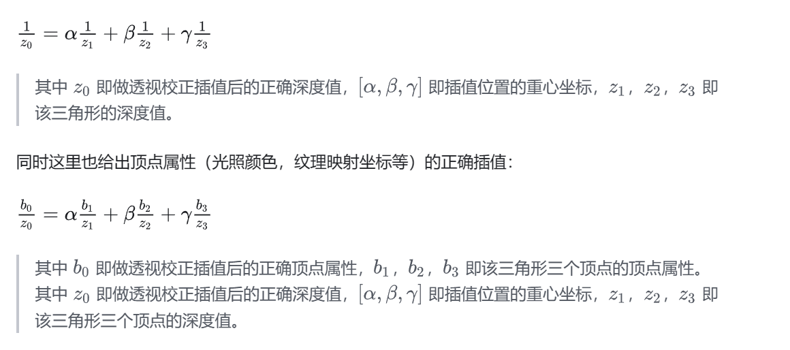

# 关于HW2框架的一些问题和要点

* 参考[《GAMES101》作业框架问题详解 - 知乎 (zhihu.com)](https://zhuanlan.zhihu.com/p/509902950)

* 深度测试实际上分为z-buffer和w-buffer两种。二者均使用完成投影变换之后的齐次坐标**(xz0,yz0,zNew,z0)**。前者使用zNew/z0来进行深度测试。而后者则使用齐次坐标的w分量，而变换之后，w分量值恰为投影之前在view空间中的z坐标值，也即原本三维空间中的深度。参考[详细介绍Z-Buffer与W-Buffer-阿里云开发者社区 (aliyun.com)](https://developer.aliyun.com/article/49272)

  * 框架中使用的应为z-buffer
  * z-buffer 保存的是经过投影变换后的 z 坐标，前面说过，投影后物体会产生近大远小的效果，所以距离眼睛比较近的地方，z 坐标的分辨率比较大，而远处的分辨率则比较小，换句话说，投影后的 z 坐标在其值域上，对于离开眼睛的物理距离变化来说，不是线性变化的（即非均匀分布），这样的一个好处是近处的物体得到了较高的深度分辨率，但是远处物体的深度判断可能会出错。
  * w-buffer 保存的是经过投影变换后的 w 坐标，而 w 坐标通常跟世界坐标系中的 z 坐标成正比，所以变换到投影空间中之后，其值依然是线性分布的，这样无论远处还是近处的物体，都有相同的深度分辨率，这是它的优点，当然，缺点就是不能用较高的深度分辨率来表现近处的物体。

* 重心坐标插值对于投影操作没有不变性，因此在projection空间中使用重心坐标插值会导致畸变，**在进行纹理贴图时尤其明显**。需要使用透视矫正插值。这里的z均为在view空间中且w分量为1时的z分量

  * 本质就是在知道在屏幕坐标空间下的该点的各重心坐标系数时，如何去求实际三维空间下该点相对于各顶点的正确比例。从而正确求得该点的color、纹理坐标等值。

    > 个人理解：在使用z-buffer时，因为我们比较的是投影空间的z分量值，所以直接在投影空间进行重心坐标插值求得该点在投影空间下的z分量，应该是没问题的

  * 参考[图形学 - 关于透视矫正插值那些事 - 知乎 (zhihu.com)](https://zhuanlan.zhihu.com/p/403259571)

